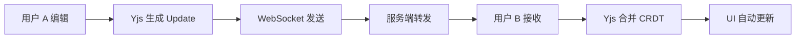

# 🔒 SecureNotes

> 离线优先、支持实时协作、端到端加密的 Markdown 笔记应用

<p align="center">
  
  
  
  
  
</p>

---

## ✨ 功能特性

| 特性 | 描述 |
|------|------|
| 📝 **富文本编辑** | 基于 TipTap 的 Markdown 编辑器，支持标题、列表、代码块、任务列表等 |
| 💾 **离线优先** | 数据存储在本地 SQLite (sql.js WASM)，无网络也可正常使用 |
| 🔄 **实时协作** | 基于 Yjs CRDT 的多人实时协作编辑，自动解决冲突 |
| 🔐 **端到端加密** | 使用 libsodium 加密，服务端只存储密文，密钥由用户管理 |
| 🔍 **全文搜索** | 即时搜索笔记标题和内容 |
| 🏷️ **标签系统** | 支持创建标签、为笔记添加标签 |
| 📎 **附件管理** | 支持图片、PDF 等文件附件 |
| 🌙 **暗色主题** | 精心设计的暗色 UI，支持 Glassmorphism 效果 |

---

## 🏗️ 技术架构

```
┌─────────────────────────────────────────────────────┐
│                  Electron Client                     │
│  ┌──────────────────────┐  ┌──────────────────────┐ │
│  │   Renderer (React)   │  │   Main Process       │ │
│  │                      │  │                      │ │
│  │  ┌────────────────┐  │  │  ┌────────────────┐  │ │
│  │  │  TipTap Editor │  │  │  │  IPC Handlers  │  │ │
│  │  └───────┬────────┘  │  │  └───────┬────────┘  │ │
│  │  ┌───────▼────────┐  │  │  ┌───────▼────────┐  │ │
│  │  │ Zustand Store  │◄─┼──┼─►│   sql.js WASM  │  │ │
│  │  └───────┬────────┘  │  │  │    (SQLite)    │  │ │
│  │  ┌───────▼────────┐  │  │  └────────────────┘  │ │
│  │  │  Yjs (CRDT)    │  │  │                      │ │
│  │  │  Sync Engine   │  │  │                      │ │
│  │  │  libsodium     │  │  │                      │ │
│  │  └────────────────┘  │  │                      │ │
│  └──────────────────────┘  └──────────────────────┘ │
└────────────────┬────────────────────────────────────┘
                 │ WebSocket / REST API
┌────────────────▼────────────────────────────────────┐
│              NestJS Backend (server/)                │
│  ┌──────────┐  ┌───────────┐  ┌──────────────────┐ │
│  │ JWT Auth │  │ Sync API  │  │ WebSocket 协作    │ │
│  └────┬─────┘  └─────┬─────┘  └────────┬─────────┘ │
│       └──────────┬───┘                  │           │
│          ┌───────▼────────┐             │           │
│          │   PostgreSQL   │             │           │
│          └────────────────┘             │           │
└─────────────────────────────────────────────────────┘
```

### 技术栈

| 层级 | 技术 |
|------|------|
| **前端框架** | React 19 + TypeScript |
| **构建工具** | Vite 5 + vite-plugin-electron |
| **桌面框架** | Electron 28 |
| **编辑器** | TipTap (ProseMirror) |
| **状态管理** | Zustand |
| **本地数据库** | sql.js (WASM 版 SQLite) |
| **CRDT** | Yjs |
| **加密** | libsodium-wrappers (Argon2id + XSalsa20-Poly1305) |
| **后端** | NestJS 10 + TypeORM |
| **后端数据库** | PostgreSQL |
| **认证** | JWT + bcrypt |

---

## 🚀 快速开始

### 前置要求

- **Node.js** >= 18
- **npm** >= 9
- **PostgreSQL** (仅后端需要)

### 安装与运行

```bash
# 克隆项目
git clone <repo-url>
cd electron-vite-boilerplate

# 安装依赖
npm install

# 启动开发模式 (Electron + Vite HMR)
npm run dev
```

### 启动后端 (可选)

```bash
cd server
npm install

# 配置数据库连接 (可在 app.module.ts 中修改)
# 默认: localhost:5432, 用户 postgres, 数据库 securenotes

npm run dev
```

---

## 📁 项目结构

```
electron-vite-boilerplate/
├── electron/                    # Electron 主进程
│   ├── main.ts                  # 窗口创建 + 应用生命周期
│   ├── preload.ts               # contextBridge API (IPC 桥接)
│   ├── ipc-handlers.ts          # IPC 处理器注册
│   ├── types/
│   │   └── index.ts             # 共享类型定义 (Note, Tag, Attachment)
│   └── database/
│       ├── connection.ts        # sql.js 初始化 + 文件持久化
│       └── repositories/
│           ├── notes.ts         # 笔记 CRUD + 搜索
│           ├── tags.ts          # 标签 CRUD + 关联
│           └── attachments.ts   # 附件文件管理
│
├── src/                         # 渲染进程 (React)
│   ├── main.tsx                 # React 入口
│   ├── App.tsx                  # 根组件
│   ├── vite-env.d.ts            # 类型声明 (window.api)
│   ├── components/
│   │   ├── layout/
│   │   │   ├── AppShell.tsx     # 三栏布局
│   │   │   └── Sidebar.tsx      # 搜索 + 笔记列表 + 同步状态
│   │   └── editor/
│   │       ├── EditorPane.tsx   # TipTap 编辑器 + 自动保存
│   │       └── EditorToolbar.tsx# 格式化工具栏
│   ├── stores/
│   │   └── noteStore.ts         # Zustand 状态管理
│   ├── services/
│   │   ├── collaboration.ts     # Yjs 文档管理
│   │   ├── syncEngine.ts        # 增量同步引擎
│   │   ├── cryptoService.ts     # E2E 加密服务
│   │   └── mockApi.ts           # 浏览器开发模式 Mock API
│   ├── hooks/
│   │   └── useCollaboration.ts  # Yjs 文档生命周期 Hook
│   └── styles/
│       └── index.css            # 暗色主题设计系统
│
├── server/                      # NestJS 后端
│   └── src/
│       ├── main.ts              # NestJS 启动
│       ├── app.module.ts        # 根模块 (TypeORM + JWT)
│       ├── entities/
│       │   ├── note.entity.ts   # 笔记实体 (存储密文)
│       │   └── user.entity.ts   # 用户实体
│       ├── auth/
│       │   ├── auth.module.ts
│       │   ├── auth.service.ts  # 注册/登录 + JWT
│       │   └── auth.controller.ts
│       ├── sync/
│       │   ├── sync.module.ts
│       │   ├── sync.service.ts  # Push/Pull 同步
│       │   └── sync.controller.ts
│       └── collaboration/
│           ├── collaboration.module.ts
│           └── collaboration.gateway.ts  # WebSocket 网关
│
├── index.html                   # HTML 入口
├── vite.config.ts               # Vite + React + Electron 配置
├── tsconfig.json                # TypeScript 配置
├── package.json
└── electron-builder.json5       # Electron 打包配置
```

---

## 🔧 核心模块说明

### 1. IPC 通信

应用使用 Electron 的 `contextBridge` 进行安全的进程间通信：

```
Renderer (React)         Preload              Main Process
───────────────         ─────────             ──────────────
window.api.xxx()  →  ipcRenderer.invoke()  →  ipcMain.handle()
                                               │
                                               ▼
                                           Repository
                                               │
                                               ▼
                                           sql.js DB
```

`window.api` 提供的方法：

| 方法 | 说明 |
|------|------|
| `getNotes()` | 获取所有笔记 |
| `createNote(data)` | 创建笔记 |
| `updateNote(id, data)` | 更新笔记 |
| `deleteNote(id)` | 删除笔记 (软删除) |
| `searchNotes(query)` | 搜索笔记 |
| `getTags()` | 获取所有标签 |
| `createTag(data)` | 创建标签 |
| `addTagToNote(noteId, tagId)` | 添加标签到笔记 |
| `addAttachment(noteId, path)` | 添加附件 |

### 2. 数据库 (sql.js)

使用 WASM 版 SQLite，无需原生编译：

- **初始化**: 应用启动时异步加载 WASM 二进制
- **持久化**: 每次写操作后调用 `saveDatabase()` 将内存数据写入磁盘
- **存储位置**: `%APPDATA%/electron-vite-boilerplate/securenotes.db`

### 3. TipTap 编辑器

编辑器配置了以下扩展：

| 扩展 | 功能 |
|------|------|
| `StarterKit` | 基础格式 (段落、标题、列表、引用等) |
| `Placeholder` | 空内容提示文字 |
| `Highlight` | 文字高亮 |
| `TaskList/TaskItem` | 任务列表 (复选框) |
| `Link` | 超链接 (自动检测) |
| `Image` | 图片插入 |
| `Collaboration` | Yjs CRDT 协作 (预留) |

### 4. 端到端加密

```
用户密码 → Argon2id → 主密钥
                        │
                        ▼
                 笔记内容 → XSalsa20-Poly1305 加密 → 密文
                                                     │
                                                     ▼
                                              存储/传输到服务器
```

- **密钥派生**: Argon2id (抗 GPU 暴力破解)
- **对称加密**: XSalsa20-Poly1305 (AEAD)
- **密钥分享**: Sealed Box (匿名公钥加密)

### 5. 同步引擎

```
本地修改 → 标记 is_dirty → 入队 → 批量发送 → 服务器确认 → 标记已同步
                                     ↑
                            失败后重试 (最多 5 次)
```

### 6. 后端 API

| 端点 | 方法 | 说明 |
|------|------|------|
| `/auth/register` | POST | 注册用户 |
| `/auth/login` | POST | 登录获取 JWT |
| `/api/sync/push` | POST | 推送笔记变更 |
| `/api/sync/pull?since=N` | GET | 拉取增量更新 |
| `/api/sync/notes` | GET | 获取所有笔记 |
| WebSocket `/collaboration` | - | 实时协作 (Yjs 更新转发) |

---

## 🛠️ 开发指南

### 常用命令

```bash
npm run dev          # 启动开发 (Vite HMR + Electron)
npm run build        # 构建生产版本 + 打包 Electron
npm run preview      # 预览构建结果
```

### 添加新的 IPC 方法

1. 在 `electron/types/index.ts` 添加类型
2. 在对应的 `repositories/` 中添加数据操作方法
3. 在 `electron/ipc-handlers.ts` 注册 `ipcMain.handle`
4. 在 `electron/preload.ts` 暴露方法到 `window.api`
5. 在 `src/services/mockApi.ts` 添加对应的 mock 实现

### 添加新的编辑器功能

1. 安装 TipTap 扩展: `npm install @tiptap/extension-xxx`
2. 在 `EditorPane.tsx` 的 `extensions` 数组中注册
3. 在 `EditorToolbar.tsx` 添加工具栏按钮

### 浏览器开发模式

直接访问 `http://localhost:5173` 可以在浏览器中预览 UI，无需启动 Electron。此模式使用 `mockApi.ts` 提供的内存数据，不持久化。

---

## 📦 构建与打包

```bash
# 构建生产版本
npm run build
```

生成文件位于 `release/` 目录。打包配置见 `electron-builder.json5`。

---

## 🤝 协作开发流程



1. 每个笔记对应一个 `Y.Doc` 实例
2. 编辑操作生成 Yjs Update (增量二进制)
3. 通过 WebSocket 转发给同一笔记的其他协作者
4. CRDT 算法自动解决冲突，无需手动合并

---

## 📋 数据库表结构

```sql
-- 笔记
CREATE TABLE notes (
  id            TEXT PRIMARY KEY,     -- UUID
  title         TEXT DEFAULT '',
  content       TEXT DEFAULT '',      -- TipTap HTML
  created_at    TEXT,
  updated_at    TEXT,
  deleted_at    TEXT,                  -- 软删除
  sync_version  INTEGER DEFAULT 0,
  is_dirty      INTEGER DEFAULT 1     -- 待同步标记
);

-- 标签
CREATE TABLE tags (
  id    TEXT PRIMARY KEY,
  name  TEXT UNIQUE,
  color TEXT DEFAULT '#6366f1'
);

-- 笔记-标签关联
CREATE TABLE note_tags (
  note_id TEXT REFERENCES notes(id),
  tag_id  TEXT REFERENCES tags(id),
  PRIMARY KEY (note_id, tag_id)
);

-- 附件
CREATE TABLE attachments (
  id          TEXT PRIMARY KEY,
  note_id     TEXT REFERENCES notes(id),
  filename    TEXT,
  mime_type   TEXT,
  size_bytes  INTEGER,
  file_path   TEXT,                   -- userData 下的相对路径
  created_at  TEXT
);
```

---

## 📄 License

MIT
